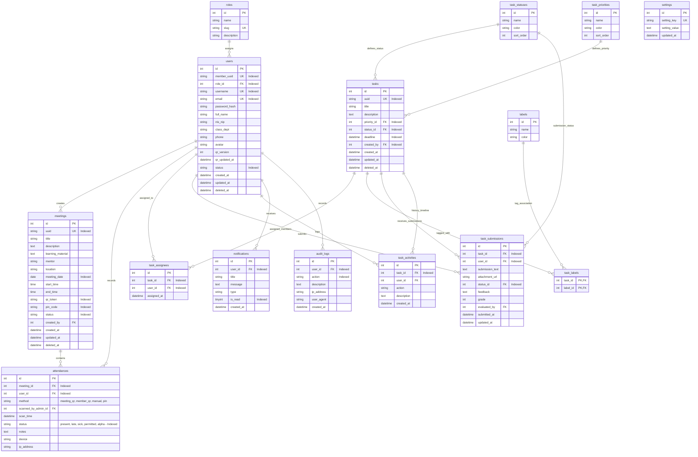

# Database Entity-Relationship Diagram (ERD) & Schemas

## 1. Mermaid Entity-Relationship Diagram

---

## 2. Indexing Strategy Summary

1. **`users` Table**:
   - `member_uuid` (UNIQUE INDEX)
   - `username` (UNIQUE INDEX)
   - `email` (UNIQUE INDEX)
   - `role_id` (INDEX)
   - `status` (INDEX)

2. **`meetings` Table**:
   - `uuid` (UNIQUE INDEX)
   - `qr_token` (INDEX)
   - `pin_code` (INDEX)
   - `meeting_date` (INDEX)
   - `status` (INDEX)

3. **`attendances` Table**:
   - `meeting_id` (INDEX)
   - `user_id` (INDEX)
   - `status` (INDEX)
   - Composite Index: `(meeting_id, user_id)` for duplicate check optimization.

4. **`tasks` Table**:
   - `uuid` (UNIQUE INDEX)
   - `priority_id` (INDEX)
   - `status_id` (INDEX)
   - `deadline` (INDEX)
   - `created_by` (INDEX)

5. **`task_assignees` Table**:
   - Composite Index / Keys: `(task_id, user_id)`

6. **`notifications` Table**:
   - `user_id` (INDEX)
   - `is_read` (INDEX)
